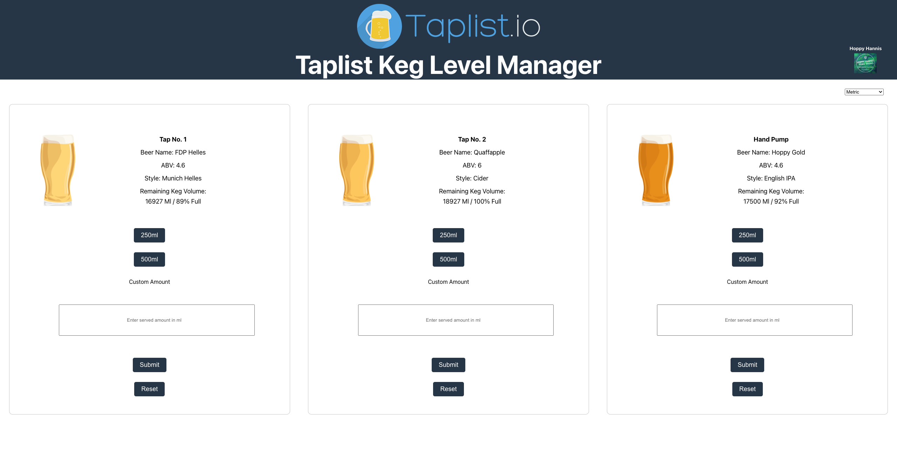

# Taplist Keg Level Manager


### Manage your Taplist keg levels through a simple interface

## Features

Supports metric, US imperial and British Imperial units. Buttons can be used for standard pours, or a custom amount can be entered.

## Instructions

### A paid subscription to [taplist.io](https://taplist.io) is required

Log into your taplist.io account and select 'Account' in the navigation bar and then 'Integrations'. Create and API key and copy it. The key you need will start with 'secret-'

Run the Taplist Keg Level Manager and enter your venue name and the API Key.


Your tap information will be populated. Enter the amount you've served from the keg in ml and the tap will be updated. Press 'Reset' to reset to the default full volume for the keg selected.



## Build Instructions

#### Required

You will need to have [docker](https://www.docker.com) installed on your system

In your terminal, run ```docker pull joehannis/taplist-keg-level-manager:latest```

Create a file called ```docker-compose.yml``` and paste this:

```
version: "3"
services:
  mongodb:
    image: mongo:latest
    container_name: mongodb-container
    ports:
      - "27017:27017"
    networks:
      - my-network
    volumes:
      - ./mongodb-data:/data/db

  api:
    build:
      context: ./api
      dockerfile: Dockerfile
    image: joehannis/taplist-keg-level-manager:api-latest
    container_name: api-container
    ports:
      - "3000:3000"
    networks:
      - my-network
    environment:
      MONGODB_URL: mongodb://mongodb-container:27017/taplist-klm

  frontend:
    build:
      context: ./frontend
      dockerfile: Dockerfile
    image: joehannis/taplist-keg-level-manager:frontend-latest
    container_name: frontend-container
    ports:
      - "5173:5173"
    networks:
      - my-network
    environment:
      REACT_APP_API_URL: http://api-container:3000

networks:
  my-network:

volumes:
  mongodb-data:
```
In terminal, ```cd``` to the directory containing docker-compose.yml.

Run ```docker-compose -f ./docker-compose.yml up```

#### If you use this and enjoy it, please consider [buying me a beer](https://www.buymeacoffee.com/joehannisjp) 🍺!
